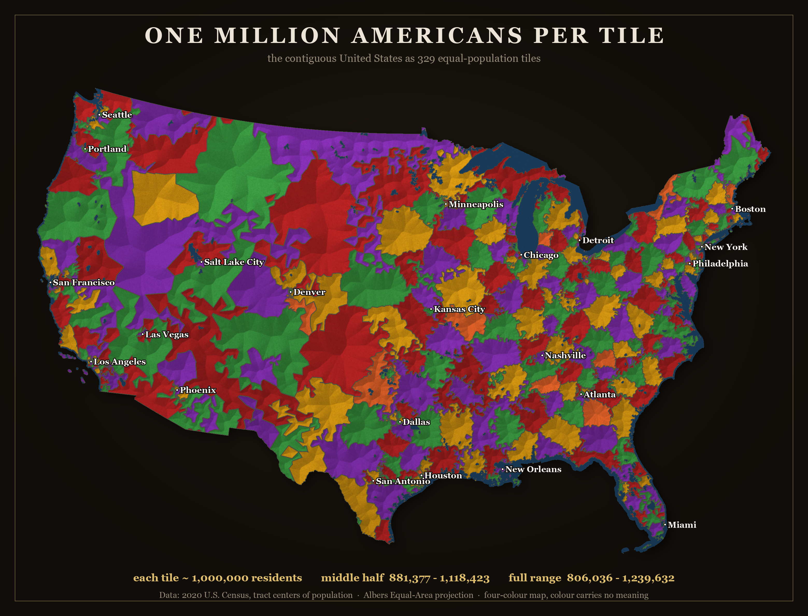
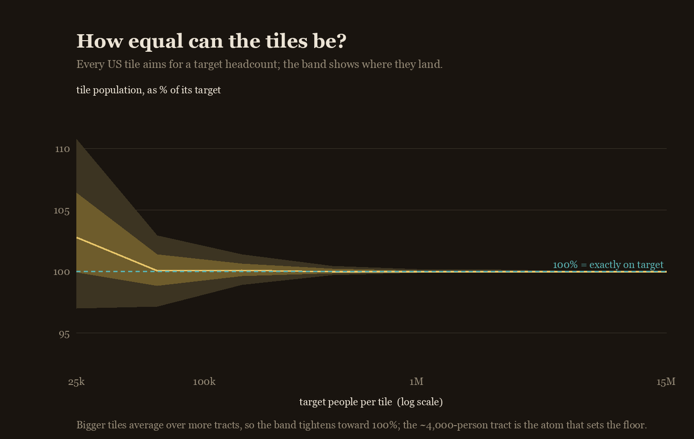
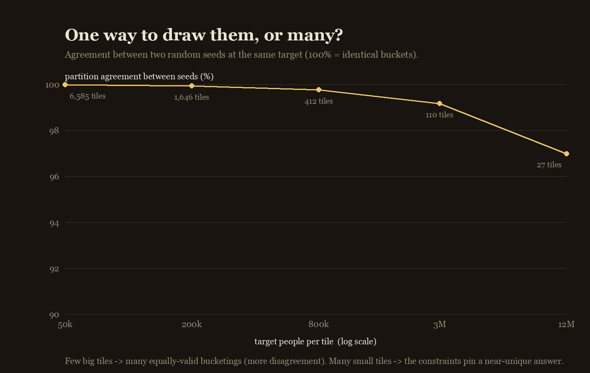
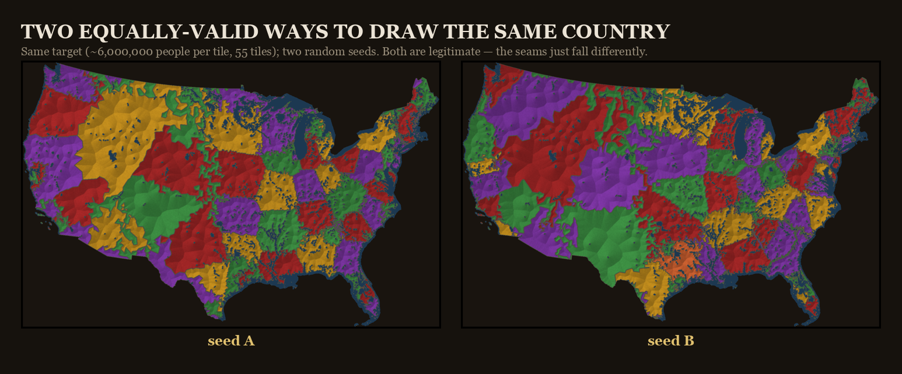

# One Million Americans Per Tile

Cut a state — or the whole country — into pieces that each hold **about the same number of
people**. Because every tile holds the same headcount, a tile's *size* is inverse population
density: a million people fit in a few city blocks in one place, and sprawl across half a state in
another. Tiles are coloured with the **fewest colours so no two neighbours match** (the colour
means nothing); rivers and lakes are blue.

> **🔗 Live site: [abigailhaddad.github.io/million-tiles](https://abigailhaddad.github.io/million-tiles/)**



It's a fine-grained take on an old idea — see [Prior work](#prior-work). Everything is
built from public-domain US Census data; no API key.

## Quick start

Requires `python3` with `numpy`, `scipy`, `Pillow`. No other dependencies — boundary data is
fetched from public Census endpoints with the stdlib.

```bash
python3 -m venv .venv && source .venv/bin/activate
pip install -r requirements.txt
./fetch_data.sh                                   # ~14 MB of Census centers-of-population data

# the whole lower-48, one tile ≈ one million people: framed print + city labels + hover page
python tools/tiles_us.py --k 1000000 --height 1800 --palette dark --cities --html

# pick another palette, or another headcount
python tools/tiles_us.py --k 500000 --palette pastel --cities

# the analyses + the palette sheet
python tools/us_analysis.py                       # accuracy + uniqueness, nationally
python tools/us_palette_sheet.py                  # every palette on the national map
```

Outputs land in `output/`. State boundary GeoJSON is fetched on first use and cached under
`data/cache/` (so the first national run is slower).

## How it's built

1. **Units.** Census *block groups* (~1,500 people, with polygons) for a state; *tract centers of
   population* (~4,000 people, just points) for the nation. Census *blocks* are finer still (often a
   single city block), but there are ~8 million of them — far too many to cluster — so tracts are
   the practical floor.
2. **Adjacency.** Block-group polygons give it directly; the national point set uses a Delaunay
   triangulation of the projected tract centres.
3. **Bucketing.** Grow contiguous clusters to a target headcount (`regionalize`), move border units
   to equalise population (`balance`), force the tile count to `round(total / target)`
   (`enforce_count`), and optionally round the shapes in (`compactify` — trading a little spread for
   less "gerrymandered" tiles).
4. **Colour.** A DSATUR **proper graph colouring**: the fewest colours so no two adjacent tiles
   match — the four-colour theorem in practice (planar maps need ≤4). Colour carries no data.
5. **Render.** Softly beveled tiles; water despeckled/thinned and painted blue; an optional
   framed-print composite. The contiguous US uses an **Albers Equal-Area** projection so the country
   isn't north-south stretched.

## How equal *can* they be?

If you optimise for equality alone, very. The band tightens as the target grows — each tile averages
over more tracts — until it hits the floor set by the ~4,000-person tract atom; above ~150k people
per tile it's essentially exact.

**But the published map isn't that tight, on purpose.** Forcing every tile to be *exactly* a million
stretches them into thin, gerrymandered shapes, so the render trades a little equality for rounder
tiles (`compactify` + `repair_outliers`): most tiles land within ±5% of a million and none past ±10%.



## One way to draw them, or many?

Cluster the same target from different random seeds and measure how much they agree (Rand index).
With **many small tiles**, the equal-population + contiguity constraints pin a *near-unique* answer —
seeds barely disagree (agreement ≈ 1.000 at thousands of tiles). With **few big tiles**, real
combinatorial freedom opens up: different seeds find genuinely different, equally-valid bucketings
(agreement falls to ≈ 0.97 at a few dozen tiles). So "how many ways are there?" depends on how big
you make the pieces.



**Why does the seed change the map at all?** The tiles are grown one at a time from randomly-ordered
starting points (`regionalize`), and the population-equalising moves (`balance`, `compactify`) are
applied in random order too — so the seed decides *where* the buckets start growing and *how* ties
are broken. Since there is no unique equal-population partition, different seeds settle on different
valid ones. Two such maps, same target, different seeds:



(The shape *rule* — compact vs. stringy — barely changes *which* units group together; it mostly
sets how round the borders are. `tools/shape_compare.py` measures that.)

## Explore it

- **[Hover the country](docs/assets/national-hover.html)** — each tile shows its population and which
  states it covers, and by what %.

(The same engine works on a single state from real block-group polygons via `tools/tiles.py`,
but the live site is US-only.)

## Data sources

`fetch_data.sh` pulls the public-domain Census inputs:

- **Centers of population** — 2020 Census block-group & tract population-weighted centroids.
- **County population** — Census population estimates (also maps state code → FIPS).

State / water / parks GeoJSON come from Census **TIGERweb** on demand (cached, git-ignored). All
public domain / open government data.

## Repo layout

```
src/
  state_data.py     fetch + cache + rasterize any state -> region map
  build_national.py Albers CONUS projection + land/water masks
  families.py       the tile renderer (bevel + edges)
tools/
  tiles_us.py  the national tiling: tracts -> buckets -> framed print + hover HTML
  tiles.py     a single state from real block-group polygons
  us_analysis.py    the accuracy + uniqueness analyses (national)
  us_palette_sheet.py  every palette on the national map
  pop_sweep.py / pop_sweep_plot.py   accuracy-vs-target for one state
  shape_compare.py  do the shape rules matter, or do the constraints dominate?
docs/               the static site (GitHub Pages): index.html + assets/
data/               Census inputs (git-ignored; ./fetch_data.sh)
output/             renders (git-ignored)
```

## Prior work

Partitioning a place into equal-population pieces is an old idea. The closest relatives are Neil
Freeman's [Fifty States with Equal Population](http://fakeisthenewreal.org/reform/), the
[Engaging Data / FlowingData](https://engaging-data.com/splitting-us-by-population/) "split the US by
population" interactives, Slate's Equal Population Mapper, and capacity-constrained Voronoi /
automated-redistricting methods generally. What's different here is the **granularity** — hundreds of
tiles, so it reads as a texture rather than a few regions — and the analysis of *how accurate* and
*how unique* the bucketings are.

## License

MIT. Built from public-domain US Census data.
