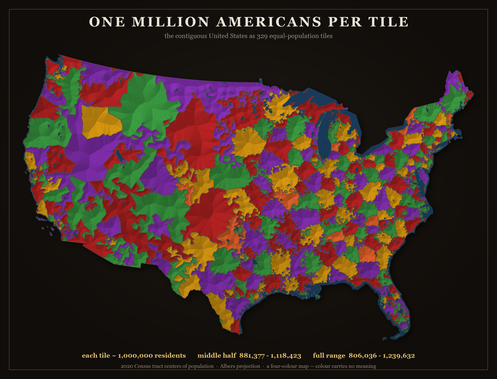

# One Million Americans Per Tile

Tile a place — a state, DC, or the whole country — so **every tile holds about the same number
of people**. A tile's *size* is then inverse population density: tiny where millions pack in,
vast where almost no one lives. Tiles are 4-coloured so no two neighbours share a colour (the
colour carries no meaning), and the rivers are painted blue.

It's a fine-grained, art-leaning take on the equal-population-partition idea — see
[Prior art](#prior-art). Everything is built from public-domain US Census data; no API key.



## Quick start

```bash
python3 -m venv .venv && source .venv/bin/activate
pip install -r requirements.txt
./fetch_data.sh                                   # ~14 MB of Census data

# the whole lower-48, one tile ≈ one million people, as a framed art print + hover HTML
python tools/pop_mosaic_us.py --k 1000000 --height 1800 --palette dark --html

# a single state or DC (real block-group tiles), with a neighbourhood-hover HTML
python tools/pop_mosaic.py "District of Columbia" \
    --literal --merge 9000 --color adjacency --grout 1.4 --html
```

Outputs land in `output/`. State boundary GeoJSON is fetched from the Census on first use and
cached under `data/cache/` (so the first national run is slower).

## What's here

| script | what it makes |
|---|---|
| `tools/pop_mosaic_us.py` | the national tiling — tracts → Delaunay adjacency → Albers, 13 palettes, framed art print, hover HTML |
| `tools/pop_mosaic.py` | a single state / DC from real block-group polygons |
| `tools/us_palette_sheet.py` | a contact sheet of every palette on the national map |
| `tools/pop_sweep.py` · `pop_sweep_plot.py` | how tight a population band you can hit vs the target headcount (table / chart) |
| `tools/shape_compare.py` | do the shape rules matter, or do the constraints dominate? |

## How it works

1. **Units** — Census *block groups* (~1,500 people, polygons) for a state; *tract centers of
   population* (~4,000 people, points) for the nation. Blocks (~8 M) are finer but not published
   as a centers-of-population file, so tracts are the practical floor.
2. **Adjacency** — block-group polygons give it directly; the national point set uses a Delaunay
   triangulation.
3. **Bucketing** — grow connected clusters to a target headcount, equalise population by moving
   border units (`balance`), force the tile count to `round(total/target)` (`enforce_count`), and
   optionally round the shapes in (`compactify`, trading a little spread for less "gerrymandered"
   tiles).
4. **Colour** — a DSATUR proper graph colouring: the fewest colours so no two adjacent tiles
   match (planar maps need ≤4).
5. **Render** — bevel + thin grout; water despeckled/thinned and painted blue; an optional framed
   "art print" composite.

## Data

`fetch_data.sh` pulls the public-domain Census inputs:
- 2020 block-group & tract centers of population
- county population estimates (also maps state code → FIPS)

State / water / parks GeoJSON come from Census TIGERweb on demand. DC neighbourhoods (hover only)
come from DC Open Data "Neighborhood Clusters".

## Prior art

The *idea* of partitioning a place into equal-population pieces is well-established. Closest
relatives: Neil Freeman's [Fifty States with Equal Population](http://fakeisthenewreal.org/reform/),
the [Engaging Data / FlowingData](https://engaging-data.com/splitting-us-by-population/) "split the
US by population" interactives, Slate's Equal Population Mapper, and capacity-constrained Voronoi /
automated-redistricting methods generally. What's different here is the *granularity* (hundreds of
tiles → a texture, not a few regions) and the *art-first execution* (mosaic rendering, four-colour
map, the analysis layer, the hover).

## Requirements

`numpy`, `scipy`, `pillow`. See `requirements.txt`.

## License

MIT.
